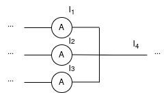
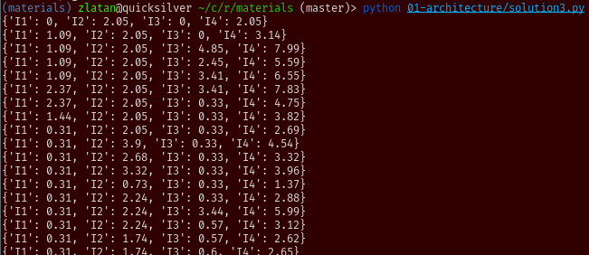

Arhitektura
===========

Ovaj primjer oslanja se na drugo predavanje o arhitekturama industrijskih IoT
sustava.

Zadatak
-------

Zamisljena je situacija da imamo sljedeci dio elektricne sheme:

Ampermetri su industrijski uredaji koji svoja stanja notificiraju pomocu IEC104
protokola. Zadatak je citati te podatke, ispisati ih na konzolu i u taj ispis
ukljuciti i novu vrijednost, koja bi predstavljala struju I4, zbroj ostale tri
jakosti struja.

Implementacija zadatka moze se preuzeti iz `repozitorija
<https://github.com/rppiot2021/01-architecture>`_. Strukturiran je tako da se u
paketu ``simulator`` nalazi implementacija simulatora ampermetara. Simulaciju
je potrebno pokrenuti prema uputama iz repozitorija i ispis bi trebao izgledati
ovako:

U paketu ``solution`` nalazi se rjesenje zadataka do kojeg smo dosli na
predavanju. Ono moze posluziti kao referenca, a u nastavku cemo detaljnije
objasniti poduzete korake za dolazak do njega.

Rjesenje
--------

Priprema
''''''''

Prvi korak u dolasku do rjesenja je ostvarivanje komunikacije sa simulatorom.
Prema njegovim uputama, on svoje podatke posluzuje na adresi
``127.0.0.1:9999``, koristeci protokol IEC104. IEC104 je industrijski protokol
koji se cesto koristi u podrucju elektroenergetike, a ovdje je iskoristen jer
ima relativno jednostavno sucelje.

Ako znamo s kakvim komunikacijskim protokolom uredaj radi, iduci korak za
ostvarivanje komunikacije je nalazak odgovarajuce upravljacke biblioteke koja
implementira protokol IEC104. Takva biblioteka pruzala bi svojim korisnicima
funkcije i klase za otvaranje konekcije s uredajem, slanje i primanje podataka
s te konekcije. Jedna implementacija upravljacke biblioteke za IEC104 je
biblioteka koju smo koristili na predavanju, `hat-drivers
<https://hat-drivers.hat-open.com>`_ iz ``hat-open`` projekta. Ova biblioteka
sadrzi i druge protokole, no u ovom primjeru se samo fokusiramo na `IEC104
<https://hat-drivers.hat-open.com/iec104.html>`_.

``asyncio``
'''''''''''

Gledanjem dokumentacije biblioteke, vidimo da je prva funkcija koju je potrebno
koristiti `hat.drivers.iec104.connect
<https://hat-drivers.hat-open.com/py_api/hat/drivers/iec104/index.html#hat.drivers.iec104.connect>`_,
koja otvara konekciju s uredajem. Iz potpisa funkcije mozemo vidjeti nove
potrebe:

  * funkcija je ``async``, odnosno, namjenjena je pokretanju kroz Pythonovu
    ``asyncio`` infrastrukturu
  * adresa na kojoj simulator posluzuje podatke je jedini obvezni argument

Adresa je vec navedena u samom zadatku, a asyncio pokrecemo s ovakvim kodom:

.. literalinclude:: solutions/1_asyncio.py
    :language: python

Sad u ``async_main`` funkciji mozemo koristiti ``await`` pozive za pokretanje
konkurentnih metoda (vise o koristima ``asyncio``-a mozete vidjeti u sluzbenoj
dokumentaciji). Prakticno, to nam omogucava da koristimo ``iec104.connect``
funkciju.

"Grubo" rjesenje
''''''''''''''''

U ovom dijelu razviti cemo rjesenje koje prakticno rjesava problem, ali ne
uzima u obzir dobre organizacijske prakse kojih se drzimo ako odaberemo neku
arhitekturu. Umjesto postojanja tri nezavisne, specijalizirane komponente,
cijeli IoT sustav bit ce implementiran u jednoj ``while`` petlji.

Prvi korak je otvaranje veze na ampermetre, moguce ga je napraviti pozivom
``await iec104.connect(iec104.Address('127.0.0.1', 9999))``. Ovdje je adresa
predana kroz strukturu podataka specificiranu od strane `drivera
<https://hat-drivers.hat-open.com/py_api/hat/drivers/iec104/connection.html#hat.drivers.iec104.connection.Address>`_.

Nakon sto smo se spojili na ampermetar, zelimo ocitavati podatke s njega.
``connect`` funkcija nam je vratila instancu klase
`hat.drivers.iec104.Connection
<https://hat-drivers.hat-open.com/py_api/hat/drivers/iec104/connection.html#hat.drivers.iec104.connection.Connection>`_.
Gledanjem dokumentacije te klase, vidimo da to mozemo pomocu metode
`hat.drivers.iec104.Connection.receive
<https://hat-drivers.hat-open.com/py_api/hat/drivers/iec104/connection.html#hat.drivers.iec104.connection.Connection.receive>`_.
Ova metoda ne prima nikakve argumente i vraca listu instanci klase
`hat.drivers.iec104.Data
<https://hat-drivers.hat-open.com/py_api/hat/drivers/iec104/common.html#hat.drivers.iec104.common.Data>`_.
Ako dodamo ispis vrijednosti koje su primljene kao argument, nase rjesenje
trenutno izgleda ovako:

.. literalinclude:: solutions/2_raw_output.py
   :language: python

A ispis, ako ga pokrenemo paralelno uz simulator izgleda ovako:

Vidimo kako ispis izgleda dosta neuredno, razlog tome je cinjenica da paketi
IEC104 protokola sadrze dosta dodatnih informacija, poput kvalitete podatka,
vremena kad je ocitan, i sl., koje nam trenutno nisu potrebne i mozemo ih
ignorirati. Konkretno, citanjem `opisa zadatka
<https://github.com/rppiot2021/01-architecture>`_, vidimo da nam je jedino
zanimljivo polje, osim ``value`` u kojem je zapisana vrijednost ocitanja,
``asdu_address`` jer njega koristimo kao identifikator ampermetra (razlikovanje
I1, I2 i I3). Jos jedan suptilni detalj je cinjenica da u ``value`` nije
zapisan direktno broj, vec, kako IEC104 podrzava slanje razlicitih tipova
podataka preko istog sucelja, zapisana je instanca klase
`hat.drivers.iec104.FloatingValue
<https://hat-drivers.hat-open.com/py_api/hat/drivers/iec104/common.html#hat.drivers.iec104.common.FloatingValue>`_.
To oznacava da je preko protokola primljen realni broj i da mu se moze
pristupiti preko varijable ``hat.drivers.iec104.FloatingValue.value``. Dakle,
do identifikatora ampermetra dolazimo preko ``data[0].asdu_address``, a do
iznosa ocitanog na ampermetru preko ``data[0].value.value``. ``[0]`` je
potreban jer je preko ``receive`` metode moguce primiti vise od jednog podatka,
no zadatak je postavljen tako da se uvijek notificira jedna promjena pa je
ovakav hack prihvatljiv.

Dodatni zahtjev je kontinuirano izracunavanje vrijednosti I4, zbroja ostale tri
struje, i njegov kontinuirani ispis na konzoli. Radi jednostavnosti provjere,
ispisivati cemo stanje sve tri struje uz I4. Uz to, radi urednosti ispisa,
dodatno cemo zaokruziti sve vrijednosti na dvije decimale. Stanja cemo cuvati u
dictionary-ju gdje su nam kljucevi imena struja, a vrijednosti njihovi iznosi.
Mozemo ga izvesti ovako:

.. literalinclude:: solutions/3_no_architecture.py
   :language: python

Ispis ce sada izgledati ovako:

Ovime smo zadovoljili minimalne potrebe zadatka, no ne mozemo tvrditi da je
rjesenje dugorocno odrzivo. Ako se potrebe promijene, npr. zelimo komunicirati
s drugim protokolom, potrebna su dodatna mjerenja, nove vrste izracuna ili
drugaciji nacin vizualizacije, takve promjene je tesko implementirati u ovakvo
rjesenje. Zbog toga si mozemo pomoci tako da rjesenje implementiramo pomocu
specijaliziranih komponenti.

Rjesenje bazirano na predlozenoj arhitekturi
''''''''''''''''''''''''''''''''''''''''''''

U predavanju je predstavljena okvirna ideja kako generalno izgledaju
arhitekture IIoT sustava. Obicno nastanu tri glavne komponente, jedna za
komunikaciju s fizickim uredajima, druga za obradu podataka koji se prime s
njih i treca za prezentaciju podataka korisniku. Ovakvu vrstu specijalizacije
cemo uvesti i u nase rjesenje.

Klase su najjednostavniji nacin kako mozemo definirati odvojene komponente i
implementirati njihovu specijaliziranu logiku. Prva komponenta koja se namece
je komponenta za komunikaciju s uredajima. Shodno tome, definiramo klasu
``Communication`` koja sadrzi logiku za ostvarivanje veze s uredajem, primanje
podataka s njega i njihovo daljnje slanje u modul za obradu podataka. Zasad
nemamo komponentu za obradu podataka, tako da cemo cijelu logiku obrade i
prezentacije podataka kopirati u funkciju koja obavlja primanje podataka. Tako
dolazimo do sljedece verzije rjesenja:

.. literalinclude:: solutions/4_communication_component.py
   :language: python

Ispis rjesenja izgleda isto kao i kod ranije verzije rjesenja. Razlog tome je
jednostavan, logika je ostala ista, samo je cijela petlja prebacena u
``Communication`` klasu. Sad cemo ju dodatno razbiti tako sto cemo dodati novu
komponentu za obradu podataka, implementiranu u klasi ``Processing``. Ona ima
glavnu metodu ``process``, koja sadrzi logiku za izracun struje I4 i ispis
podataka (zasad, dok ne dodamo komponentu za vizualizaciju). Jos jedan dodatak
je da sad ``Communication`` komponenta treba imati referencu na ``Processing``
jer je to najjednostavniji nacin da ju "obavijesti" o tome da je primila novo
ocitanje. Alternativa bi bila da komuniciraju na neki drugi nacin, npr. preko
`asyncio.Queue <https://docs.python.org/3/library/asyncio-queue.html>`_, zapisa
i citanja datoteke, preko socketa, ... Tako dolazimo do nove verzije naseg
rjesenja:

.. literalinclude:: solutions/5_processing_component.py
   :language: python

Konacno, ako zelimo imati arhitekturu opisanu u predavanju, fali nam jos i
komponenta za vizualizaciju. Trenutno se cijelo stanje aplikacije ispisuje
diraktno na konzolu, htjeli bismo tu logiku izdvojiti u zasebnu komponentu i
mozda izbaciti neki stiliziraniji ispis od Pythonove pretvorbe dictionary-ja u
string. Stvaramo novu klasu, ``Visual``, koja ima metodu ``render``. Ona prima
stanje aplikacije u formatu koji propisuje ``Processing`` klasa, i ispisuje
vrijednosti na konzolu. Zaokruzivanje mozemo takoder prebaciti u ovu klasu,
posto je ono u ovom slucaju iskljucivo vizualna prilagodba podatka. Slicno kao
i kod povezivanja klasa za komunikaciju i obradu podataka, komponenta za obradu
podataka ima referencu na komponentu za vizualizaciju, kako bi joj mogla
proslijediti nove verzije svog stanja. Alternative takvom obliku komunikacije
iste su kao i kod veze komunikacija-obrada. Tako dolazimo do ove verzije
rjesenja:

.. literalinclude:: solutions/6_visual_component.py
   :language: python

Ona sad ima i drugaciji ispis, koji izgleda ovako:

Ovime smo implementirali rjesenje problema koje je ujedno i arhitekturalno
smisleno, odnosno, moguce ga je prosirivati s dolaskom novih zahtjeva. Logicke
cjeline su medusobno odvojene i relativno jednostavno ih mozemo prilagodavati
po potrebi. Jedna ocita slabost ovako postavljenog sustava je cinjenica da
pojedine komponente moraju biti upoznate s nacinom kako funkcioniraju ostale
komponente u sustavu. Tako npr, ``Communication`` klasa mora znati za
``Processing`` i mora znati sto mu salje u ``process`` metodu. Ako se ikad
dogodi da nam takvo sucelje vise ne bude dovoljno dobro, potrebno je raditi
ekstenzivnije modifikacije (mijenjati i ``Processing`` i ``Communication``
komponente). I dodatak novih uredaja/komunikacijskih protokola s kojima se radi
i dalje zahtjeva reorganizaciju ``Communication`` dijela. Zbog svega ovoga,
pribjegavamo koristenju gotovih rjesenja koja se brinu o infrastrukturi oko
dijelova implementacije koji su specificni za konkretni problem koji se
rjesava. Konkretne primjere ovoga vidjet cemo kad krenemo raditi s
infrastrukturnim komponentama koje su implementeirane u sklopu ``hat-open``
projekta.
