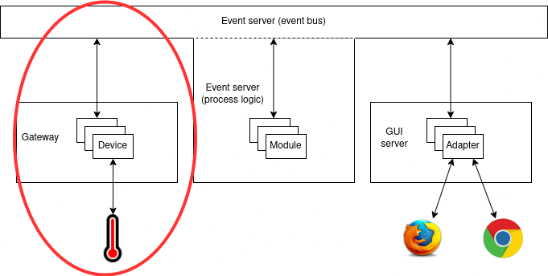
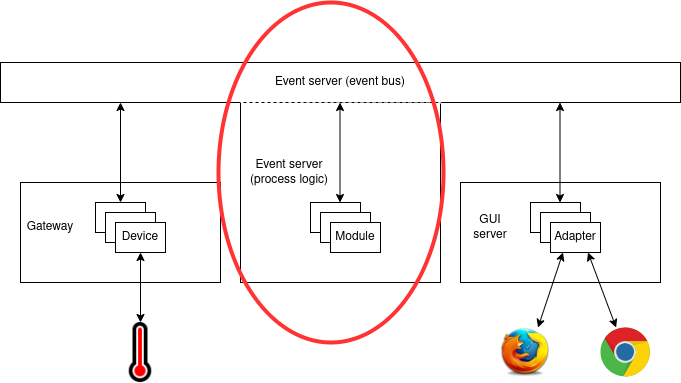
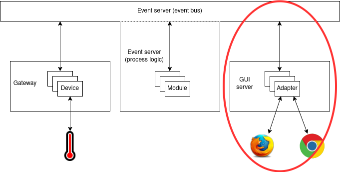

Modbus hat aplikacija
=====================

U proslom zadatku vidjeli smo kako se spojiti Modbus protokolom na termometar
kroz jednostavnu Pyhton skriptu. U ovom dijelu implementiramo slicnu stvar,
koristenjem komponenti iz hat-open projekta. Poglavlje o Hatu temeljito opisuje
pojedine komponente a ovdje cemo ih primjeniti za rjesavanje problema s
termometrom.

Repozitorij
-----------

Krecemo s repozitorijem `hat-quickstart
<https://github.com/rppiot2021/hat-quickstart>`_. Ovo je template repozitorij
na temelju kojeg se mogu kreirati novi repozitoriji (`Use this template` gumb).
U repozitoriju su napisane upute kako postaviti razvojno okruzenje. Ono bi
trebalo raditi na Linuxu, kod ostalih operacijskih sustava mozda naidete na
probleme i u tom slucaju preporucujemo rad ili kroz virtualnu masinu ili kroz
docker.

Repozitorij ima par bitnih direktorija. Prvi su ``src_py`` i ``src_js``, u
kojima ce se nalaziti implementacija nase aplikacije. Python dio implementacije
fokusirat ce se na ocitanje i obradu podataka, a JavaScript na vizualizaciju
kroz web sucelje. U ``playground`` direktoriju imamo razlicite pomocne skripte
i konfiguracije pomocu kojih se sustav moze pokretati. Ostale datateke i
direktoriji se takoder koriste, ali na ove cemo se uglavnom fokusirati tijekom
rada na ovom zadatku. Pozicioniranjem u direktorij ``playground/run`` mozemo
pokrenti skriptu ``system.sh`` (ili ``.bat`` za Windowse), otvoriti
``localhost:23023`` i vidjeti minimalno graficko sucelje s jednim brojacem.

Bacimo li dublji pogled na to sto se tocno dogada pozivom ``system`` skripte,
vidimo da ona pokrece ``hat-orchestrator`` komponentu. Ova komponenta sluzi
tome da paralelno starta proizvoljni broj drugih procesa. Pogledamo li njenu
konfiguraciju, u ``playground/run/data/orchestrator.yaml``, vidimo u
``components`` polju koji procesi se sve pokrecu. Vidimo da su to druge
komponente iz hat-open projekta (pogledajte predavanje 3.1. za kratki pregled
komponenti koje postoje i neke njihove generalne svrhe). Za rjesenje problema,
implementirati cemo jedan device, event server modul i adapter. Takoder cemo
prilagoditi view da ima tocniji ispis, tj. da ne pise `counter` vec
temperature.

Rjesenje
--------

Ovdje opisujemo pristup koji uzimamo kad rjesavamo problem, komponentu po
komponentu. Krecemo od devicea koji ce nam komunicirati s modbus uredajem,
nakon toga implementiramo event server modul, koji ce obavljati izracun
temperature (djeljenje s 10 jer protokol salje vrijednost pomnozenu s 10), iza
toga adapter koji ce pripremati te podatke za vizualizaciju, i konacno view
kojeg cemo prilagoditi da prikazuje podatke. U quickstart repozitoriju vec
postoje primjeri za svaki od ovih tipova specijaliziranih modula, tako da cemo
se donekle oslanjati samo na njihovu modifikaciju.

Device
~~~~~~

Zelimo implementirati device koji ce svakih nekoliko sekundi slati Modbus
zahtjev za citanje na termometar i registrirati dogadaj s informacijom koja je
primljena preko protokola. Slicnu funkcionalnost smo vec implementirali u
drugom zadatku, samo sad ju trebamo upakirati u implementaciju devicea i
umjesto ispisa na konzolu, registrirati dogadaj. Implementacija uredaja u
``src_py/project/devices/example.py`` je u principu dovoljno dobra, glavna
modifikacija koju trebamo napraviti je prilagodba countera. `Example` verzija
uredaja se ne spaja na nista nego samo ima jedan interni brojac kojeg
inkrementira svakih nekoliko sekundi. Umjesto toga, mi se zelimo spojiti na
termometar i svakih nekoliko sekundi registrirati ocitanje s njega. Takoder,
putanja ``project/devices/example`` je malo nejasna, tako da cemo ju
preimenovati u nesto sto ima smisla za nas projekt:
``workshop/devices/modbus``.

Primjetimo da sad vise ne mozemo pozvati sustav kroz ``system.sh/bat``. Razlog
tome je upravo ova promjena putanje, device koji konfiguriramo u gatewayu ima
staro Python ime, pa cemo ga prilagoditi u ``module: workshop.devices.modbus``
(u ``playground/run/data/gateway.yaml``). Uz to, dodatno cemo prilagoditi
konfiguraciju tako da damo konkretnija imena deviceu i gatewayu: ``modbus1`` i
``gateway1``.

Device sad izgleda ovako:

.. literalinclude:: repo/src_py/workshop/devices/modbus.py
   :language: python

Trebalo bi se moci pokrenuti, no sad smo uveli promjene zbog kojih osnovni
quickstart primjer nece moci samostalno raditi. Ali, to ce se promijeniti kad
prilagodimo ostale komponente.

Modul
~~~~~

Sad se prebacujemo na event server module. Ako pogledamo koji moduli postoje,
vidjet cemo direktorij ``src_py/project/modules`` s modulima ``example.py`` i
``enable_all.py``. ``enable_all`` mozemo ignorirati, njegova svrha je da
registrira dogadaje za paljenje deviceova (vise info u poglavlju o Hatu).

Odmah cemo oba modula prebaciti u ``workshop/modules``, a ``example`` cemo
preimenovati u ``temperature`` jer cemo ga preinaciti u to da racuna
temperaturu na temelju dogadaja koje registrira device.

Znamo da device registrira ocitanja temperatura u dogadajima s tipom
``('gateway', 'gateway1', 'modbus', 'modbus1', 'gateway', '4003')``, tako da
cemo pretplatiti modul na taj tip. Nakon toga, nema neke potrebe za vecim
preinakama, osim prilagodbe ``process`` metode u sesiji od modula. Ona ce sad
registrirati dogadaj s tipom ``('temperature')`` a payload ce joj biti tocna
temperatura, iznos koji primi preko Modbusa podijeljen s 10.

Implementacija modula izgleda ovako:

.. literalinclude:: repo/src_py/workshop/modules/temperature.py
   :language: python

Ne zaboravimo da je i dalje potrebno uvesti promjene u konfiguraciju, analogne
promjenama u gatewayu, dakle imena modula.

Adapter
~~~~~~~

Konacno se fokusiramo na vizualizaciju. Prvi korak je implementacija adaptera
koji bi preko svog sucelja za komunikaciju s web klijentima posluzivao stanje
u kojem je ocitanje temperature. On bi se pretplacivao na ``('temperature')``
dogadaj koji registriramo u event serverovom modulu.

Ako pogledamo adaptere iz quickstarta, vidimo da postoji
``src_py/project/adapters/example.py``. Njega cemo prilagoditi da ne radi vise
s brojacem, vec da se pretplacuje na promjene temperature i prosljeduje ih
svojim sesijama. To postizemo implementacijom ``create_subscription`` funkcije.
Drugi korak je proslijedivanje temperature sesijama, sto se dogadalo u
``_main_loop`` metodi. Ona zapravo moze biti ista, ali malo cemo prilagoditi
imena varijabli, nema potrebe da se temperatura pohranjuje u privatnim
varijablama adapterove klase itd. Tako dolazimo do sljedece implementacije:

.. literalinclude:: repo/src_py/workshop/adapters/temperature.py
   :language: python

Opet cemo promijeniti putanju adapteru tako da ga prebacimo u
``workshop/adapter`` i preimenujemo u ``temperature.py`` (nema veze sto je isto
kao i modul, sama cinjenica da su u drugim direktorijima je dovoljna
distinkcija), pa je potrebno prilagoditi i konfiguraciju. Osim promjene
putanje, prilagoditi cemo i ime adaptera iz ``adapter`` u ``temperature``.

View
~~~~

Da bi prilagodba bila kompletna, potrebno je prilagoditi i view. Dosad nismo
toliko zalazili u detalje kako se view implementira, ali nam za pocetak oni
nisu ni previse bitni. Implementacija viewa je u
``src_js/views/main/index.js``. Vidimo da vec postoji neka implementacija koja
ima funkciju ``vt`` koja vraca listu. Lista sadrzi ime taga i njegov sadrzaj.
Za graficke prikaze koristimo bibilioteke koje ovakve strukture podataka
pretvaraju u DOM (Document Object Model). Tako kad implementiramo view, ono sto
vrati njegova funkcija proslijeduje se tim bibliotekama i one generiraju DOM s
elementima::

    counter: 10

Ocita je jos jedna promjena - izraz ``r.get('remote', 'adapter', 'counter')``
se pretvoro u broj 10. U viewovima preko varijable ``r`` pristupamo `renderer
objektu <https://hat-renderer.hat-open.com/>`_ (dokumentacija je nekompletna,
bolje mozda gledati kod). Cijela ideja iza renderera je da on ima neko svoje
stanje i na temelju tog stanja generira DOM. Kad se stanje promijeni, ponovno
se pokrene izracun DOM-a na temelju tog novog stanja. Stanju pristupamo preko
funkcije ``r.get``, a mozemo ga mijenjati preko funkcije ``r.set``. Tako kad
kazemo ``counter: r.get('remote', 'adapter', 'counter')``, zapravo oznacavamo
da iza dvotocke pise vrijednost procitana iz stanja aplikacije. Argumentima
poslanim ``r.get`` funkciji odredujemo putanju do dijela stanja koji nas
zanima. Konkretno u ovom slucaju, brojacu pristupamo s putanjom
``remote/adapter/counter`` jer je stanje objekt::

    { remote: { adapter: { counter: 10 } } , local: {}, xyz: 100, ... }

Kod viewova postoji dodatni aspekt rada sa stanjem, a to je cinjenica da je
nasa aplikacija spojena na GUI server. GUI server notificira promjene stanja
svojim klijentima. To znaci da se u nekom trenutku implicitno poziva ``r.set``
kad neki adapter prijavi da mu se stanje promijenilo. Konkretno, dio stanja na
koji utjece adapter nalazi se na putanji ``remote/<ime_adaptera>``.

Vracajuci se na radionicu, dosadasnji view s brojacem nam vise ne odgovara,
htjeli bismo da umjesto counter pise temperature. Dodatno, mijenjali smo ime i
strukturu stanja adaptera, pa vise ni ``r.get`` nije precizan. Ako zelimo
promijeniti tekst, prevodimo ``counter:`` u ``temperature:``, a nova putanja je
``remote/temperature`` (``temperature`` je ime adaptera, a njegovo stanje je
samo jedan broj).

Ta implementacija sad bi trebala izgledati ovako:

.. literalinclude:: repo/src_js/views/main/index.js
    :language: javascript

Nakon buildanja viewa (``doit js_view``), mozemo otvoriti browser na adresu
``http://127.0.0.1:23023`` i vidjeti nas novi termometar.
