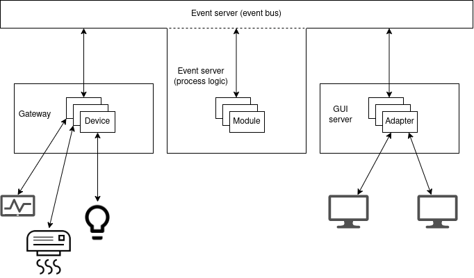
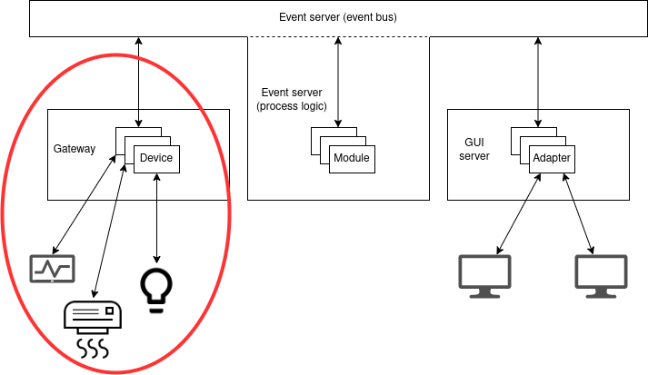
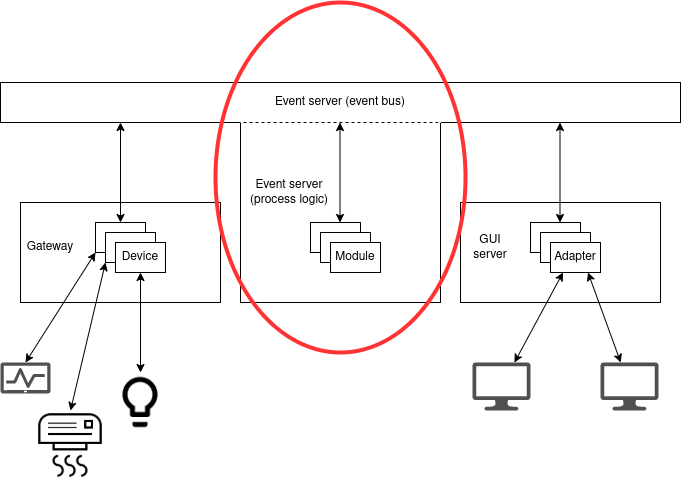
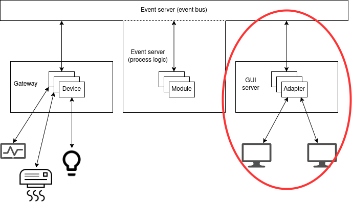

Komponente
==========

Podsjetimo se jos jednom na event-driven arhitekturu industrijskog IoT sustava:

Spomenuli smo da komponente Hat projekta preslikavaju ovu arhitekturu, na
sljedeci nacin:

  * `hat-gateway <https://hat-gateway.hat-open.com>`_ komponenta je zaduzena za
    komunikaciju s uredajima
  * specijalizirani moduli `hat-event <https://hat-event.hat-open.com>`_
    komponente su zaduzeni za implementaciju procesne logike
  * `hat-gui <https://hat-gui.hat-open.com>`_ komponenta je zaduzena za
    vizualizaciju

Sve tri komponente imaju jednu zajednicku crtu, a to je da su same
implementacije komponenti genericne, ali se konfiguriraju da koriste
implementacije specijaliziranih modula u kojima je sadrzana konkretna domenska
logika specificna za aplikaciju koja se razvija. To konkretno znaci da
komponenta specificira odredeno sucelje koje modul mora zadovoljiti,
implementator sustava napravi implementaciju tog sucelja i kad pokrece
komponentu, u konfiguraciji joj zada da koristi tu implementaciju. Ovako se
onda komponenta vise brine za "infrastrukturne" stvari, poput spajanja na event
server, suradivanja sa specijaliziranim modulima, itd., a specijalizirani
moduli implementiraju aplikaciju.

Prije nego sto se bacimo na konkretne komponente, kratki pregled terminologije
koju cemo koristiti od sad:

  * device - specijalizirani modul gateway komponente
  * modul - specijalizirani modul event servera
  * adapter - specijalizirani modul GUI komponente

Pogledajmo sad arhitekturu sustava, sad kad znamo za specijalizirane module:

Gateway
-------

Gateway komponenta upravlja svojim specijaliziranim modulima, devicevima, cija
zaduzenja su komunikacija s uredajima i pretvorba podataka koje prime preko te
komunikacije u dogadaje. Ona se pokrece pozivom ``hat-gateway`` kojem se preko
argument ``--conf`` zadaje konfiguracija u JSON ili YAML formatu. Konfiguracija
je specificirana `JSON shemom
<https://github.com/hat-open/hat-gateway/blob/master/schemas_json/main.yaml>`_,
a jedan minimalni primjer mogao bi biti:

.. literalinclude:: components/gateway.yaml
   :language: yaml

Najzanimljiviji argumenti ovdje su nam ``devices`` i ``gateway_name``.
``gateway_name`` ce nam biti bitan kasnije jer ce biti sadrzan u tipu dogadaja
s kojim rade devicevi (i njihovi konzumenti). ``devices`` sadrzi postavke
specijaliziranih modula, konfigurira se jedan device ciji modul je
implementiran u ``devices.ammeter`` (gateway ce u nekom trenutku pozvati liniju
``import devices.ammeter``). On ima pridruzen i ``name`` koji ima slicnu svrhu
kao i ``gateway_name``, bit ce bitan kasnije jer ce biti sadrzan u tipu
dogadaja konkretnog devicea. ``log`` polje mozda izgleda zastrasujuce, ali to
je zapravo samo konfiguracija Pythonvog ``logging``  modula koja se ovdje
konfigurira da ispisuje logove na konzolu.

Pogledajmo sada `sucelje
<https://hat-gateway.hat-open.com/py_api/hat/gateway/common.html#hat.gateway.common.Device>`_
koje pojedina implementacija devicea mora zadovoljiti. Vidimo da ona mora biti
izvedena kao Python modul, koji ima globalne varijable ``device_type``,
``json_schema_id`` i ``json_schema_repo``, te funkciju ``create``.
``device_type`` sluzi za klasifikaciju tipa uredaja s kojim komuniciramo,
obicno bude jednak imenu protokola koji se koristi. Namjena mu je slicna kao i
ranije spomenutim ``gateway_name`` i ``device_name`` konfiguracijskim
parametrima, budu elementi unutar tipa dogadaja koji se odnose na taj device.
``json_schema_id`` i ``json_schema_repo`` su opcionalni pa ih necemo koristiti,
a odnose se na mogucnost konfiguriranja devicea. Svaki device moze propisivati
svoju strukturu konfiguracije, a format za specifikaciju te strukture je JSON
shema. Repo sadrzi shemu a ID kaze s kojim ID-em u shemi se konfiguracija
usporeduje. Opcionalni su, tako da ce u nasim primjerima uvijek biti ``None``.

``create`` funkcija zaduzena je za stvaranje instance klase `Device
<https://hat-gateway.hat-open.com/py_api/hat/gateway/common.html#hat.gateway.common.Device>`_.
Po dokumentaciji, ona prima tri argumenta: event klijent, konfiguraciju i
"prefiks" tipa dogadaja. S event klijentom smo se bavili u proslom dijelu,
takvog klijenta primamo ovdje i mozemo ga koristiti na isti nacin. Moze se
primjetiti da on nije bas istog tipa kao i event klijent iz proslog dijela,
razlog tome je cinjenica da gateway komponenta stvara svoj wrapper oko
originalne instance iz nekih infrastrukturnih razloga (jedan "pravi" klijent za
cijeli gateway, odredba pretplata itd.). Konfiguracija je drugi argument, ona
je jednaka bilo cemu sto se zapise u konfiguraciji gatewaya u elementima polja
``devices``. Treci argument, prefiks tipa dogadaja je zapravo tuple stringova
``('gateway', gateway_name, device_type, device_name)``. Za tip dogadaja smo
odredili da je definiran kao tuple stringova, svi dogadaji s kojima device radi
moraju imati ovaj prefiks. To znaci da svaki dogadaj kojeg device registrira bi
trebao pocinjati s ova 4 stringa, npr. ``('gateway', 'gateway1', 'iec104',
'iec104_device1', 'measurement_change')``, ako je ime gatewaya ``gateway1``,
tip devicea ``iec104``, a ime ``iec104_device1``. Gatway komponenta ne
prisiljava da bude ovaj prefiks, to je samo dobra praksa. Ista stvar vrijedi i
za primanje dogadaja, ``receive`` metoda event klijenta kojeg device primi u
``create`` funkciji vracati ce samo dogadaje kao da je pretplacena na
``(*event_type_prefix, '*')``. Nije specificirano u prefiksu, ali nakon njega
se obicno navodi smjer komunikacije, odnosno ako dogadaj registrira device onda
je to ``gateway`` a ako ga registrira neki drugi aktor a device ga treba
primati, smjer je ``system``. Opet, komponenta ne prisiljava ovo ali se potice.

Sad mozemo pogledati neku konkretnu implementaciju gateway devicea. Uzeti cemo
raniji primjer s ampermetrima i pretvoriti klasu funkcije ``Communication`` i
preraditi ju da vise ne zove ``process``, vec samo registrira dogadaj i ne
brine sto se dalje dogada s njim:

.. literalinclude:: components/devices/ammeter.py
   :language: python

Jedna nejasnoca koja bi se mogla javiti citanjem ovog koda je svrha
``hat.aio.Group`` klase, koristenja njene ``spawn`` metode, njenog vracanja
kroz property ``async_group``, ... Property ``async_group`` je potreban zbog
sucelja koje propisuje ``hat.gateway.common.Device`` (on nasljeduje
``hat.aio.Resource``, a on propisuje da mora postojati taj property). Ideja je
da se instanca tog objekta koristi za odredivanje zivotnog ciklusa devicea.
Instanca moze biti u otvorenom ili zatvorenom stanju, otvoreno stanje oznacava
da device treba raditi, a zatvoreno da ne treba. Metoda ``spawn`` od grupe
ponasa se slicno kao `asyncio.create_task
<https://docs.python.org/3/library/asyncio-task.html#asyncio.create_task>`_,
glavna razlika je da Task koji bi se vratio se veze uz stanje otvorenosti grupe
- ako se grupa ikad zatvori, Task ce se otkazati (poziv ``Task.cancel``) - ovo
nam ide u korist jer onda stanje otvorenosti grupe zaista upravlja cinjenicom
izvrsava li se ``_main_loop`` ili ne.

Jedan detalj nismo spomenuli, a bitan je za pokretanje gatewaya s deviceom, je
potreba za registracijom dogadaja za paljenje devicea. U `dokumentaciji
<https://hat-gateway.hat-open.com/gateway.html#event-server-communication>`_
mozemo vidjeti kakvu strukturu imaju ti dogadaji. Dakle, potrebno je
registrirati dogadaj s tipom ``(*prefiks, 'system', 'enable')`` i payloadom
``True`` jer to signalizira gateway komponenti da pokrene device koji smo
konfigurirali.  Najjednostavnije to mozemo napraviti s odvojenom skriptom:

.. literalinclude:: components/enable_device.py
   :language: python

Jos detalja za pokretanje, event server mora biti startan, gateway ga ocekuje
na adresi ``tcp+sbs://127.0.0.1:23012``. Uz to, treba pokrenuti i simulator iz
prvog zadatka, inace ce device izbaciti exception jer connect nece proci.

Prilagodimo li sad naseg ranijeg konzumenta dogadaja (ili skriptu za upite) da
prate dogadaje tipa ``('gateway', 'gateway1', 'ammeter', 'ammeter1', '*')``,
vidjeli bismo da se zaista registriraju ovi dogadaji, nakon ``ammeter`` dijela
je identifikator mjerenja (ASDU adresa iz proslog zadatka), a payload je broj
koji predstavlja iznos mjerenja. Ako ima problema oko starta gatewaya, tipa
dolazi do ispisa greske ``No module named ...``, dodajte direktorij iz kojeg
pokrecete u environment varijablu ``PYTHONPATH`` (`linux (bash)
<https://askubuntu.com/a/58828>`_, `windows
<http://www.dowdandassociates.com/blog/content/howto-set-an-environment-variable-in-windows-command-line-and-registry/>`_).

Iduci korak je procesna logika u kojem cemo razviti specijalizirani modul koji
ce primati informacije o strujama od devicea i stvarati nove dogadaje na
temelju njih.

Event server
------------

Event server smo vec vidjeli u situacijama gdje implementira sabirnicu
dogadaja, a sad cemo vidjeti kako pomocu njegovih specijaliziranih modula
mozemo implementirati procesnu logiku aplikacije. Ona se izvodi tako da se
specijalizirani moduli event servera pretplate na dogadaje odredenog tipa i,
kad se dogadaji s tim tipom registriraju, stvore nove dogadaje na temelju njih.

Mozemo preuzeti konfiguraciju iz proslog dijela, glavna razlika je da cemo sad
u ``module_engine/modules`` dodati konfiguraciju specijaliziranog modula:

.. literalinclude:: components/event.yaml
   :language: yaml

Dakle, u odnosu na dio gdje smo se fokusirali na nacin kako slati dogadaje
preko event servera, ovdje je razlika da smo dodali specijalizirani modul
``modules.state`` (kao i kod gatewaya, ovo je Python ime modula, u nekom
trenutku event server ce zvati ``import modules.state``).

Sad je potrebno zaista implementirati modul. Gledanjem `dokumentacije
<https://hat-event.hat-open.com/py_api/hat/event/server/common.html#hat.event.server.common.Module>`_,
mozemo vidjeti da se to radi tako da definiramo modul tako da implementiramo
Python modul koji ima globalne varijable ``json_schema_id``,
``json_schema_repo`` i funkciju ``create``. Kod globalnih varijabli vrijedi
ista prica kao i kod deviceva, a ``create`` je korutina koja vraca instancu
klase ``hat.event.server.common.Module``. Ona prima konfiguraciju modula i
referencu na instancu klase ``hat.event.module_engine.ModuleEngine``.
Konfiguracija modula je iz konfiguracije cijelog event servera, ono sto je
napisano uz ``module: <Python ime modula>``, a module engine je objekt koji
sluzi kao sucelje event servera prema modulu. Ako pogledamo `njegovu
dokumentaciju
<https://hat-event.hat-open.com/py_api/hat/event/server/module_engine.html>`_,
vidimo da ima slicne metode kao event klijent.

Kao i device, modul nasljeduje ``hat.aio.Resource`` abstraktnu klasu, pa mora
imati ``async_group`` property.  Uz njega, ima i property ``subscription``
kojim se specificira na kakve dogadaje se modul pretplacuje (mala razlika je da
to sad vise nije lista tupleova, vec se predaje
``hat.event.common.subscription.Subscription`` objektu).

Metoda ``create_session`` je iduca komplikacija. Ideja je da moduli zapravo ne
obavljaju registraciju dogadaja sami po sebi, vec da stvaraju sesije koje to
rade za njih. Ovo je vise do implementacijskih detalja event servera, gdje kad
se registrira dogadaj, event server stvori sesiju svakog modula i onda, ako se
modul pretplacuje na dogadaj koji se registrirao, koristi tu sesiju da stvori
nove dogadaje. Implementator modula ima korist od toga jer moze imati
distinkciju izmedu razlicitih sekvenci obrada podataka, necega za cime nemamo
potrebu u sklopu nasih zadataka - zbog toga cemo obradu podataka u sesiji
obicno samo proslijediti nazad modulu. ``create_session`` ne prima nikakve
argumente, a vraca instancu objekta ``hat.event.server.common.ModuleSession``.

``ModuleSession`` je abstraktna klasa koja nasljeduje ``hat.aio.Resource``,
dakle ima property ``async_group`` iz istih razloga kao i device i modul. Uz
to, ima i metodu ``process`` koja prima i vraca listu dogadaja. Lista koju
prima je sadrzi dogadaje na koje se modul predplacuje kroz ``subscription``
property, a lista koju vraca je sadrzi nove dogadaje koje zeli registrirati.
Mala razlika u odnosu na dosadasnji rad s registracijom dogdaja je da se ovdje
ne koristi ``RegisterEvent``, vec je potrebno vratiti
``hat.event.server.common.ProcessEvent``. On se stvara pozivom module engineove
metode ``create_process_event`` koja prima i source, . On prima dogadaj i
identifikator izvora dogadaja, `hat.event.server.common.Source
<https://hat-event.hat-open.com/py_api/hat/event/server/common.html#hat.event.server.common.Source>`_
(za potrebe naseg jednostavnijeg rjesenja cemo ga samo izmisliti da zadovoljimo
sucelje).

Uz sve ovo imamo dovoljno informacija da napravimo primjer event server modula.
Uzeti cemo opet slucaj iz prvog zadatka s ampermetrima, a ovdje cemo napraviti
modul koji ce raditi istu stvar kao i ``Processing`` klasa, uparivanje
primljenog mjerenja sa strujama I1, I2 i I3, te racunanje struje I4. Ona bi
izgledala ovako:

.. literalinclude:: components/modules/state.py

Ovaj modul pretplacuje se na dogadaje koje registrira device i kreira svoje
dogadaje koji sadrze stanje, u istom formatu kao i u prvom zadatku.

GUI server
----------

Zadnja komponenta na koju se fokusiramo je GUI server, a ona sluzi za
vizualizaciju podataka. Ona se, s jedne strane, spaja na event server i
ukljucuje u interakciju s dogadajima, a, s druge, posluzuje HTTP servis na koji
se korisnici mogu spojiti svojim web browserima i pregledati stanje sustava.
Stanje sustava prezentira se kroz genericnu web aplikaciju, koja se moze
konfigurirati da prikazuje preglede koje implementator sustava implementira.
Aplikacija je implementirana u JavaScriptu i komunicira s GUI serverom pomocu
WebSocket protokola, odnosno `hat-juggler <https://hat-juggler.hat-open.com/>`_
wrappera. Konkretan format stanja koje GUI server salje klijentskoj aplikaciji
propisuju specijalizirani moduli GUI servera, adapteri.

Komponenta se pokrece pozivom ``hat-gui`` u komandnoj liniji. Zadaje joj se
argument ``--conf`` koji sadrzi putanju do JSON ili YAML konfiguracije koja
sadrzi konkretne postavke. Format konfiguracije propisan je `JSON shemom
<https://github.com/hat-open/hat-gui/blob/master/schemas_json/main.yaml>`_, a
jedan minimalni primjer mogao bi biti:

.. literalinclude:: components/gui.yaml
   :language: yaml

Konfiguriraju se razne adrese, jedna za spajanje s event serverom, druga na
kojoj GUI server posluzuje podatke... Konfiguriraju se i viewovi, to su
spomenuti pregledi koje mi trebamo implementirati. Nakon toga slijedi
konfiguracija korisnika. GUI server obavlja rudimentarno upravljanje
korisnicima, u konfiguraciji se navode login podatci. Za lozinke se ocekuje da
su hashirane SHA256 algoritmom, i da je `"posoljen"
<https://en.wikipedia.org/wiki/Salt_(cryptography)>`_ s nasumicnim bajtima u
``salt`` polju i ponovno hashiran. Za potrebe nasih primjera, ove stvari ce
biti hardkodirane, uvijek koristimo postavke iz ove konfiguracije, a za
korisnika ``user1`` lozinka je ``pass1``. Uz login podatke a korisnika se moze
definirati koju ulogu (``role``) ima - na ovaj nacin moze se napraviti
distinkcija izmedu administratora i obicnih korisnika te koji view korisnik
vidi nakon sto se prijavi. Konacno, nakon korisnika ide konfiguracija
specijaliziranih modula, adaptera. Vidimo slicnu strukturu kao i kod
gatewayovih deviceva, zadaje se Python ime modula (npr. ovdje ce se u nekom
trenutku zvati ``import adapters.state``) i ime adaptera koje ce se koristiti
da identificira taj adapter u komunikaciji s event serverom i klijentskom
aplikacijom.

Razvoj viewova, odnosno grafickih prikaza je tema za sebe koja ce biti
pokrivena u odvojenom poglavlju. U ovom primjeru koristiti cemo gotovu,
izbuildanu verziju viewova, a GUI server cemo samo konfigurirati da koristi te
prikaze.

Glavni dio razvoja na serverskoj strani je implementacija adaptera. Pogledajmo
sad `sucelje
<https://hat-gui.hat-open.com/py_api/hat/gui/common.html#hat.gui.common.Adapter>`_
koje ovi specijalizirani moduli moraju implementirati. Vidimo da on mora biti
izveden kao odvojeni Python modul s globalnim varijablama ``json_schema_id`` i
``json_schema_repo`` te funkcijama ``create_subscription`` i
``create_adapter``. Za globalne varijable vrijede iste primjedbe kao i kod
deviceva i event server modula, to su opcionalne varijabe koje sluze za
validaciju konfiguracije koja je postavljena te ce biti ``None`` u nasim
primjerima. ``create_subscription`` treba moci primiti jedan argument,
konfiguraciju adaptera, a vraca instancu `hat.event.common.Subscription
<https://hat-event.hat-open.com/py_api/hat/event/common/index.html#hat.event.common.Subscription>`_
klase u kojoj se navodi na kakve tipove dogadaja se adapter pretplacuje.
Konacno, ``create_adapter`` funkcija prima konfiguraciju adaptera i event
klijent, a vraca instancu klase ``hat.gui.common.Adapter``.

Ako pogledamo klasu ``hat.gui.common.Adapter`` vidimo da ona nasljeduje
``hat.aio.Resource``, dakle, kao i devicevi i event server moduli, mora imati
property ``async_group``. Uz to sama adapterova klasa propisuje da mora
postojati metoda ``create_session`` koja prima jedan argument tipa
`hat.gui.common.AdapterSessionClient
<https://hat-gui.hat-open.com/py_api/hat/gui/common.html#hat.gui.common.AdapterSessionClient>`_.
Slicno kao i moduli event servera, adapteri nece sami direktno komunicirati sa
svojim klijetima, vec imaju sesije. U ovom kontekstu, jedna sesija predstavlja
vezu na jednog klijenta koji je spojen na GUI server (mozemo to zamisliti kao
da svaka otvorena sesija predstavlja jedan web browser koji je spojen na nas
server). Vidimo da `hat.gui.common.AdapoterSession
<https://hat-gui.hat-open.com/py_api/hat/gui/common.html#hat.gui.common.AdapterSession>`_
zapravo nema nikakve dodatne metode i propertyje (osim, opet, ``async_group``
jer je instance ``hat.aio.Resource``). To znaci da imamo slobodu bilo kako
implementirati kako se tocno koristi ``AdapterSessionClient`` za komunikaciju s
klijentima.

Preko ``AdapterSessionClient``-a adapterova sesija komunicira s web aplikacijom
u browseru. Vidimo da ona ima slicne metode i propertyje kao i `juggler
konekcija <https://hat-juggler.hat-open.com/python.html>`_ (jer nam GUI server
zapravo predaje wrapper oko nje). Kod jugglera je ideja da povezuje dvije
komunikacijske tocke s WebSocket protokolom. WebSocket se inace specijalizira
za slanje poruka, a juggler nam pruza podrsku za neke dodatne funkcije. Jedna
od tih funkcija je sinkronizacija stanja - vidimo da ``Connection`` (i
``AdapterSessionClient``) ima propertyje ``local_data`` i ``remote_data``.
Jedna strana komunikacije moze u ``local_data`` zapisati bilo kakav JSON
serijalizabilni objekt (preko metode ``set_local_data``), i on ce se drugoj
strani pojaviti u njenom ``remote_data`` propertyju. Uz to, moguce je raditi i
obicno slanje poruka kroz ``send`` i ``receive`` metode, definirati RPC sucelja
itd. Prakticno, u radu s jugglerom, odnosno ``AdapterSessionClient``-om,
najvise cemo se oslanjati na sinkronizaciju stanja i slanje poruka.

Sad imamo dovoljno informacija da napravimo jednostavnu implementaciju
adaptera. Nastavljamo s nasim primjerom ranijeg zadatka s ampermetrima. Ako se
sjecamo, napravili smo modul event servera koji registrira dogadaj tipa
``('state')`` ciji payload je dictionary gdje su kljucevi imena struja, a
vrijednosti njihovi iznosi. Sad mozemo napraviti adapter koji ce to stanje
propagirati do klijenata:

.. literalinclude:: components/adapters/state.py
   :language: python

Ako ima nejasnoca vezanih uz poziv ``spawn`` metode, logika je ista kao i kod
devicea, pa predlazemo da pogledate taj dio. Dakle, adapter u ``_main_loop``
ceka promjene stanja i kad primi dogadaj, proslijedi tu informaciju sesijama.
Sesije onda dalje tu informaciju proslijede web klijentima.

Sad mozemo pokrenuti ``hat-gui`` s ovim adapterom, no jos uvijek nam fale
viewovi. Kako smo spomenuli da je njihov razvoj odvojena tema za sebe, zasad
cemo koristiti prethodno buildane resurse. Njima, i svim ostalim
implementacijama koje smo radili u ovom poglavlju, mozete pristupiti na `ovom
linku <https://github.com/rppiot2021/materials/tree/master/hat/components>`_
Pokretanjem svega (``hat-event``, ``hat-gateway`` i ``hat-gui``) i otvaranjem
adrese `127.0.0.1:23023 <http://127.0.0.1:23023>`_ trebala bi se otvoriti prvo
login stranica (user1, pass1), a nakon logina prikaz u kojem se vidi JSON
reprezentacija stanja koje smo propagirali kroz dogadaje. Iduce vece poglavlje
bavit ce se osnovama razvoja grafickog sucelja u bibliotekama iz hat-open
projekta.
