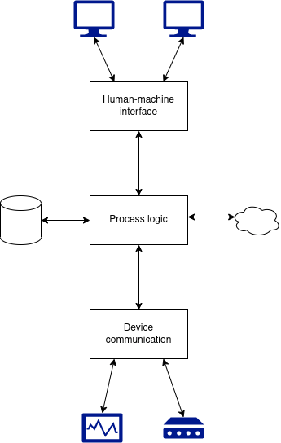
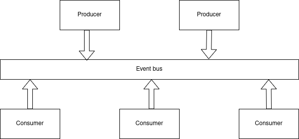

Hat
===

Prije nastavka rjesavanja problema s termometrom, dati cemo uvod u glavne
aspekte komponenti Hat projekta, jer cemo se oslanjati na njih za rjesenje. Ovo
poglavlje je zamisljeno kao prirucnik tim komponentama, i mozete mu se vratiti
kad god zapnete.

U drugom predavanju upoznali smo se s glavnim industrijskim praksama vezanim uz
organizaciju koda, i ovdje cemo ih dosta referencirati. Vidjeli smo kako
industrijski IoT sustavi obicno imaju ovakvu generalnu arhitekturu:

Takoder smo spominjali koristi izvodenja takve arhitekture pomocu event-driven
sustavi. Implementacija takvih sustava moze se vizualizirati sljedecim
dijagramom:

Vidimo kako postoje razliciti aktori u sustavu izmedu kojih se nalazi `Event
bus`, sabirnica dogadaja. Ideja je da kreatori notificiraju sabirnicu dogadaja
o novonastalim promjenama, a onda sabirnica proslijedi te informacije svim
zainteresiranim konzumentima. Dogadaj se obicno modelira kao struktura podataka
koja sadrzi informaciju o semantickom znacenju dogadaja (npr. detektirana je
promjena temperature) i konkretne podatke specificne za promjenu (npr. iznos
temperature), a mogu biti i popraceni razlicitim vremenskim oznakama (kad je
napravljeno ocitanje), dodatnim zastavicama itd.

U kontekstu industrijskih IoT sustava, generalna arhitektura predstavljena
ranije, moze se izvesti kroz event-driven sustav. Jedan nacin kako bi ona mogla
biti izvedena je sljedeci:

.. image:: images/hat-arch-base.png

Vidimo da su glavne komponente u principu ostale iste, glavna razlika je da su
one sad povezane preko sabirnice dogadaja (event bus), dok prije nije bilo
egzaktno specificirano kako komuniciraju. Komponente iz hat-open projekta imaju
ovakvu arhitekturu. Glavne komponente kojima cemo se baviti u nasim zadatcima
su event server (event bus + business logic), gateway (communication) i GUI
server (human-machine interface). Uz njih, projekt iz kojeg cemo razvijati nase
rjesenje konfigurira i druge komponente, ali njima cemo pristupati samo iz
prespektive korisnika, a manje raditi neki konkretan razvoj vezan uz njih.

.. toctree::
   :maxdepth: 1

   event_bus
   components
