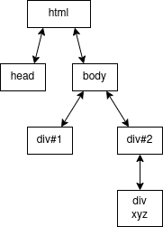

View
====

Ovo poglavlje opisuje rad s grafickim suceljima kod Hat prikaza. Strukturirano
je tako da se krece od opcenite ideje kako su strukturirane aplikacije bazirane
na Hatovim JavaScript bibliotekama, a onda prelazi na opis kako se takve
biblioteke koriste u kontekstu GUI serverovih view-ova.

Single page aplikacija
----------------------

Kad pomocu web browsera komuniciramo sa nekim HTTP serverom, obicno od njega
primamo neke HTML datoteke. Nas browser parsira taj HTML i strukturira ga u
nesto sto nazivamo `document object model` (DOM). DOM mozemo zamisliti kao
stablastu strukturu u kojoj cvorovi odgovaraju tagovima unutar HTML-a, a veze
oznacavaju vezu "roditelj-dijete", tj da jedan tag sadrzi drugi. Primjerice,
sljedeci HTML kod bi se pretvorio u stablo ispod:

.. code-block:: html

   <html>
   <head></head>
   <body>
       

       

xyz

   </body>
   </html>

DOM-u mozemo i pristupiti tako da otvorimo neku web stranicu i upalimo
`Inspect` kroz desni klik ili `Ctrl+Shift+I`, odabirom taba `Elements`. Web
browser koristi DOM kao ulaz za iscrtavanje web stranice - prode po cijelom
stablu i na temelju njega odredi gdje se na ekranu trebaju nalaziti vizualne
reprezentacije pojedinih tagova. Ako se DOM promijeni, browser automatski
ponovno iscrtava novo stanje.

JavaScript podrzava funkcije koje omogucuju manipulaciju DOM-a. Postoje
funkcije za `dohvat cvorova
<https://developer.mozilla.org/en-US/docs/Web/API/Document/querySelector>`_,
njihovo `brisanje
<https://developer.mozilla.org/en-US/docs/Web/API/Element/remove>`_ i
`dodavanje novih
<https://developer.mozilla.org/en-US/docs/Web/API/Node/appendChild>`_. S
ovakvim funkcijama mogu se raditi responzivne aplikacije, no samo takvo sucelje
je malo pregenericno za potrebe brzog prototipiranja frontend aplikacija. Zbog
ovoga, uvodimo novi koncept, virtualno stablo (`virtual tree` - VT).

VT je struktura podataka koja sadrzi reprezentaciju DOM-a. Mozemo ju zamisliti
kao jos jedno stablo koje u sebi ima instance klasi i funkcije na temelju kojih
se moze kreirati DOM. Postoje posebne biblioteke koje propisuju svoj format VT
struktura i generiraju DOM na temelju njih. Te biblioteke pruzaju mogucnost
odrzavanja reaktivnih dijelova DOM-a, gdje korisnik biblioteke biblioteci
konstantno salje nove verzije VT-a, a biblioteka se brine za azuriranje DOM-a
na temelju razlika izmedu tih verzija.

Do druge strane price dolazimo ako se zapitamo zasto bi uopce dolazilo do
nastajanja novih verzija VT-a. Tu uvodimo koncept stanja aplikacije. Stanje
mozemo zamisliti kao neku strukturu podataka u kojoj su zapisane sve
informacije potrebne za stvaranje VT-a. To mogu biti razni korisniciki unosi,
podatci koji se prime sa udaljenih API-ja i sl. Novi VT zapravo izracunavamo na
promjenu stanja, sto se moze dogoditi ili kroz korisnicku interakciju ili kroz
promjene notificirane od udaljenih API-ja.

Po ovim principima radi vecina frameworka i biblioteka gdje se radi sa
reaktivnim elementima, primjerice React, Angular, Vue, ... Sad cemo pokriti Hat
biblioteku za ovakve elemente koja se moze koristiti na slican nacin.

``@hat-open/renderer``
----------------------

Renderer je biblioteka koja oslikava koncepte predstavljene u prethodnom dijelu
- ona pruza objekte (renderere) kojima se zada funkcija za generiranje VT-a
skupa sa inicijalnim stanjem, a ti objekti se onda brinu za to da kad se
stanje promijeni, da ponovno izracunaju VT i azuriraju DOM. Obicno postoji
jedna instanca renderer objekta u cijeloj aplikaciji.

Postavljanje JS projekta
~~~~~~~~~~~~~~~~~~~~~~~~

Sad cemo ove koncpete i ilustrirati. Prvi korak je uspostavljanje novog JS
projekta i instalacija dependencyja. Za upravljanje projektom koristiti cemo
`Yarn <https://yarnpkg.com/>`_. Pozivom ``yarn init`` i odabirom default
postavki generira se datoteka ``package.json``. Njen najbitniji sadrzaj su
polje ``dependencies`` (inicijalno ne postoji) u kojem ce biti navedene
biblioteke i alati koje cemo koristiti. Nakon sto popunimo to polje s tim
bibliotekama, ``package.json`` izgleda ovako:

.. literalinclude:: source/package.json
   :language: json

Sad ako zovemo ``yarn install``, navedeni paketi ce se instalirati u direktorij
``node_modules``.

Sad definiramo datoteke u koje su nam bitne za sadrzaj implementacije i njeno
buildanje:

  * datoteka ``index.html`` koja je ulazna tocka cijele aplikacije i koja samo
    poziva JavaScript zaduzen za upravljanje reaktivnim elementima
  * ``main.js`` - implementacija aplikacije
  * ``webpack.config.js`` - konfiguracija Webpacka - alata koji cemo koristiti
    za build aplikacije. On uzima vise JavaScript stilskih datoteka i pakira ih
    u jednu ``.js`` datoteku koju onda predajemo kao ulaznu tocku u
    ``index.html``-u

``index.html`` ce biti jednostavan, samo ce imati kratki HTML u kojem pozivamo
nasu JavaScript aplikaciju. On ce ocekivati da ce imati pristup datoteci
``builtMain.js`` u kojoj se nalazi vec buildana verzija JavaScript koda. To
izgleda ovako:

.. literalinclude:: source/index.html
   :language: html

``webpack.config.js`` je u skladu s propisanim formatom `Webpackove
konfiguracije <https://webpack.js.org/configuration/>`_. Mi cemo koristiti
jednostavni primjer u kojem cemo nas ``main.js`` spojiti sa dependencyjima koji
ce se nalaziti u ``node_modules`` direktoriju i potencijalnim stilskim
datotekama koje ce imati ekstenziju ``.scss`` (`Sass
<https://sass-lang.com/guide>`_). Rezulatat tog spajanja ce se zapisati u
izlaznu datoteku ``build/builtMain.js``. On izgleda ovako:

.. literalinclude:: source/webpack.config.js
   :language: javascript

Konacno, mozemo napraviti i prvu implementaciju ``main.js``-a, ona ce zasad
imati samo jednu naredbu:

.. literalinclude:: source/main1.js
   :language: javascript

Ako pozovemo ``yarn webpack``, stvoriti ce se ``build/builtMain.js``. Iduci
korak je pokretanje HTTP servera koji ce posluzivati JS aplikaciju, mozemo
iskoristiti Pyhtonov pozivom: ``python -m http.server``. Otvaranjem adrese
``localhost:8000`` vidjet cemo ispis alerta.

.. note:: Ovdje smo napravili malo losu praksu u smislu da smo Python serverom
   posluzili sve u root direktoriju - preciznije bi bilo kopirati i index.html
   u build, prilagoditi putanju u ``head`` tagu i posluziti samo build
   direktorij. Ovako smo sad rijesili vise zbog jednostavnosti build procesa.

Renderer
~~~~~~~~

Sad cemo modificirati ``main.js`` da koristi reaktivne elemente koristenjem
renderera. Sloziti cemo funkciju ``main`` u kojoj cemo u DOM dodati novi
element i stvoriti renderer koji ce ga koristiti za prikaz svojih podelemenata.
Renderer ima funkciju ``init`` koja generira tu reprezentaciju DOM-a. Ona je
izvedena tako da se oslanja na JavaScriptove strukture podataka, gdje je cijela
reprezentacija jedno polje (``Array`` instanca). Prvi element liste je ime HTML
taga, a ostatak su ili stringovi (cisti tekst unutar taga) ili druga polja koja
predstavljaju ugnijezdene tagove. To mozemo prikazati na primjeru, uzmimo u
obzir ovakvu reprezentaciju DOM-a:

.. code-block:: javascript

   ['div',
       'abc',
       ['div', 'def'],
       'efg'
   ]

Ovakva reprezentacija pretvorila bi se u DOM koji mozemo predstaviti ovakvim
HTML-om:

.. code-block:: html

   

       abc
       
def

       efg
   

Uz to, na drugom mjestu u polju moguce je staviti i objekt unutar kojeg mozemo
definirati razne dodatne atribute koje bi htjeli pridruziti DOM elementu, neki
cesce koristeni primjeri:

.. code-block:: javascript

   ['div', {
       on: {
           click: ev => null,
           // i drugi moguci event listeneri 
       },
       props: {
           href: 'www.google.com',
           style: 'background-color: red;'
           // dodatna HTML polja
       },
       class: {
           class1: true,
           class2: false,
           // dinamicka dodjela klasa ovisno o istinitosti izraza s desne
           // strane, takoder je moguce klasu dodijeliti kod deklaracija taga
           // na pocetku, npr 'div.class3'
       }}]

Napredni korisnik takoder moze implementirati svoje funkcije koje ce se
pozivati kad renderer bude obavljao stvaranje, brisanje i modifikaciju DOM
elemenata, s istim suceljem kao i biblioteka koja se koristi u pozadini,
`snabbdom <https://github.com/snabbdom/snabbdom#hooks>`_.

Kad inicijaliziramo renderer, predajemo mu funkciju koja generira opisanu
strukturu podataka. Kod moze izgledati ovako:

.. literalinclude:: source/main2.js
   :language: javascript

Sad ako pokrenemo build i posluzimo nasu novu aplikaciju, trebali bismo vidjeti
tekst "generated by the renderer". Par dodatnih pojasnjenja:

  * s ``import r from '@hat-open/renderer'`` smo importali default instancu
    renderera, to je objekt koji cemo koristiti za generiranje reaktivnog
    HTML-a.
  * ``main`` se poziva jer smo dodali event listener na ``load`` dogadaj koji
    ga poziva
  * ``r.init`` kao prvi argument prima DOM element u koji ce ukljuciti svoje
    nove podelemente, drugi argument je inicijalno stanje (vise o radu sa
    stanjem u nastavku), a treca je referenca na funkciju za generiranje VT-a
    koju ce renderer periodicki mijenjati kad bude dolazilo do promjene stanja
  * s ``window.r = r`` smo ``window`` varijabli dodijelili referencu na
    renderer. Ovako ako otvorimo developerske alate i JavaScript konzolu, preko
    varijable ``r`` mozemo pristupati rendererovim metodama (``get`` i ``set``
    koje cemo vidjeti u nastavku)

Trenutna implementacija koristi renderer, ali jos uvijek ne mozemo tvrditi da
je reaktivna - i dalje se samo generira jedna verzija DOM-a koja se vise nikad
ne mijenja. Sad cemo to promijeniti tako da cemo uvesti rad sa stanjem
aplikacije.  Stanje moze biti bilo kakva JSON-serijalizabilna struktura
podataka. Renderer pruza dvije jednostavnije funkcije za rad sa stanjem -
``get`` i ``set``.  ``get`` prima neodredeni broj argumenata koji predstavljaju
putanju do nekog ugnijezdenog dijela stanja. Primjerice, ako imamo stanje koje
mozemo predstaviti sljedecom strukturom podataka:

.. code-block:: javascript

   {
       x: [
           {a: 'value 1'},
           {b: 'value 2'}
       ]
   }

Pozivom ``r.get('x', 0, 'a')`` pristupili bismo stringu ``'value 1'``, pozivom
``r.get('x', 1, 'b')`` bismo dobili ``value 2``. Ne moramo pristupati ni vrsnim
clanovima, tj moguce je pozvati i ``r.get('x')`` pa dobiti ``[ { a: 'value 1'
}, { b: 'value 2' } ]``. Putanje mozemo zamisliti kao niz ulancanih indeksa,
kao da, ako je stanje zapisano u varijabli ``state``, pozivamo
``state['x'][0]['a']``. Dodatni benefit je taj sto ako odredeni dio stanja ne
postoji, ``r.get`` ce vratiti ``null`` dok bi direktno indeksiranje rezultiralo
greskom ako indeksiramo nesto sto je undefined doci ce do greske. Primjerice,
ovakav poziv: ``r.get('y', 0, 'a')`` ce vratiti ``null``, dok bi
``state['y'][0]['a']`` rezultirao greskom jer je ``state['y']`` ``undefined``,
a on se ne moze dodatno indeksirati.

Prije nego sto krenemo dohvacati dijelove stanja, moramo ih prvo i postaviti.
Najjednostavniji nacin za to je preko rendererove ``set`` funkcije. Ona prima
dva argumenta - putanju i vrijednost. Slicno kao i kod ``get``, putanja je niz
brojeva i stringova koji odreduju kako tocno adresirati odredeni dio stanja.
Vrijednost je konkretna vrijednost koja ce se postaviti na dio stanja koji se
adresira. Tako, primjerice ako bismo nad stanjem iz ranijeg primjera pozvali
``r.set(['x', 0, 'a'], 'value 3')``, novo stanje bi zaista izgledalo ovako:

.. code-block:: javascript

   {
       x: [
           {a: 'value 3'},
           {b: 'value 2'}
       ]
   }

Bitna napomena je da koristenje ``r.set`` **nije** ekvivalentno
``state['x'][0]['a'] = 'value 3'`` jer renderer koristi ovu funkciju da, osim
sto postavi stanje, ponovno generira i cijeli VT. Ovakvom direktnom
modifikacijom zapravo zaobilazimo to sucelje, sto moze dovesti do nepredvidenih
posljedica.

Sad kad smo opisali generalnu ideju rada sa stanjem, mozemo pokazati i
jednostavni konkretniji primjer. U nastavku je kod za jednostavnu aplikaciju
brojaca s prikazom trenutnog stanja, gumbom za povecanje broja i za njegov
reset:

.. literalinclude:: source/main3.js
   :language: javascript

S ovim mozemo implementirati jednostavnu responzivnu aplikaciju. Jos mozemo
imati potrebu i dodatno ukrasiti nasu graficku aplikaciju koristenjem kaskadnih
stilova (CSS). Za ovo predlazemo, umjesto direktnog koristenja CSS-a, rad sa
`Sass <https://sass-lang.com/>`_-om, koji omogucuje dodatne funkcionalnosti i
bolje strukturiranje koda. Prvo cemo prilagoditi nas JavaScript kod tako da
pojednim elementima dodijelimo klase, kako bismo im kasnije mogli davati
stilove. Uz to, napraviti cemo i import datoteke s implementacijom stila koju
cemo kasnije napisati. Kod sad izgleda ovako:

.. literalinclude:: source/main4.js
   :language: javascript

Uz to, sad mozemo napisati i nasu ``style.scss`` datoteku:

.. literalinclude:: source/style.scss
   :language: scss

I sad imamo i novu verziju grafickog sucenja koja ima i stilove.

GUI view
--------

Sad mozemo prethodna znanja primjeniti na razvoj GUI viewova. View je zapravo
JS aplikacija koja je zamisljena da se koristi kroz renderer. GUI server
posluzuje web aplikaciju. Ta aplikacija preko konekcije na GUI server dobiva
konfigurirane viewove. View je buildani (preko Webpacka) JavaScript modul koji
ima jednu ili dvije funkcije. Jedna funkcija koju view mora imati je ``vt``,
sto je onda funkcija za generiranje reprezentacije VT-a. Ona ne mora primati
nikakve argumente i vraca VT strukturu podataka. Opcionalna funkcija je jos i
``init``, ona se moze iskoristiti za neke inicijalne manipulacije stanja po
potrebi. View vec po defaultu ima postavljenu varijablu ``r`` na instancu
renderera, tako da ga se moze koristiti bez importa kao u prethodnim
primjerima.

S obzirom da ovdje ne inicijaliziramo svoj renderer vec ga GUI aplikacija
inicijalizira za nas, nije bas jasno kako je strukturirano stanje aplikacije
jer se to postavlja na toj razini. Ono inicijalno izgleda ovako:

.. code-block:: javascript

    {
        local: null,
        remote: null
    }

``remote`` dio stanja je dio u kojem ce se zapisivati podatci koje postavlja
adapter preko svoje ``set_local_data`` funkcije. Svaki adapter ima svoj dio
stanja koji notificira klijentima koji se nalazi pod kljucem koji odgovara
njegovom imenu (konifiguracijski parametar). Tako, primjerice, ako pristupamo
dijelu stanja koji propisuje adapter s imenom ``current``, to radimo pomocu
``r.get('remote', 'current')``.

``local`` dio stanja je dio gdje klijent moze zapisati svoj dio stanja koji
zeli podijeliti s adapterom. Tako, ako bi klijent zvao ``r.set(['local',
'current'], 100)``, ``current`` adapter bi preko svoje reference na konekciju
(``juggler_client``) mogao preko properyja ``remote`` doci do broja 100. Ovakav
nacin koristenja je malo rijedi, pa ga necemo pretjerano uzimati u obzir u
nastavku.

Uz ``local`` i ``remote`` dijelove stanja, imamo slobodu ostatak stanja
koristiti kao i kod bilo kakve druge aplikacije bazirane na rendereru. Dakle,
uz ``local`` i ``remote`` moze biti bilo kakav drugi kljuc u koji cemo mozda
pohranjivati neke interne varijable JS aplikacije.

Dodatna razlika rada kroz GUI view u odnosu na cistu aplikaciju koja koristi
renderer je ta da view moze pristupati nekim dodatnim informacijama koji primi
od GUI servera. Ovo nam je korisno jer tako iz naseg viewa mozemo pristupati
dodatnim informacijama poput konfiguracije, ulogiranog korisnika i, najbitnije,
reference na juggler konekciju preko koje se komunicira s GUI serverom. Objektu
koji sadrzi sve ovo u implementaciji viewa pristupamo preko varijable ``hat``
koja onda ima propertyje ``conf``, ``reason``, ``user``, ``roles``, ``view`` i
``conn``. Za neku najosnovniju upotrebu, dovoljna ce nam biti upotreba
``conn``.

``conn`` predstavlja konekciju na GUI server. Kod njega ce nam biti bitna
zapravo samo jedna funkcija - ``send``. Ona prima dva argumenta - ime adaptera
i JSON serijalizablini objekt. Imenom odredujemo na koji adapter saljemo
poruku, a drugi argument je njen sadrzaj. Tako onda ako u nekom trenutku, na
GUI server strani zovnemo ``await juggler_client.receive()``, dobit cemo tu
poruku koja je poslana iz JS dijela. Ovo nam onda zapravo omogucuje da odredimo
drugi smjer GUI komunikacije jer na temelju poruke koju dobijemo mozemo
registrirati nove dogadaje koji onda dalje mogu utjecati na ostatak sustava,
rezultirati slanjem poruka uredajima itd.

Korisni savjeti
---------------

Ovdje ce biti opisana neke dobre prakse na ceste probleme na koje se moze naici
tijekom rada s rendererom. Ovaj dio aktivno azuriramo na temelju feedbacka koji
dobijemo.

Pretvorba polja u niz VT elemenata
~~~~~~~~~~~~~~~~~~~~~~~~~~~~~~~~~~

Recimo da imamo sljedece stanje:

.. code-block:: javascript

    {
        items: ['row1', 'row2', 'row3']
    }

Zelimo ovo stanje pretvoriti u DOM koji ce imati sljedecu HTML reprezentaciju:

.. code-block:: html

    

        row1
         
        row2
         
        row3
         
    

Najjednostavniji pristup bio bi:

.. code-block:: javascript

    function vt() {
        const rows = [];
        for (let row of r.get('items')) {
            rows.push(['span', row]);
            rows.push(['br']);
        }
        return ['div', rows];
    }

Ovakav pristup je prihvatljiv, ali moze postati problematican ako imamo potrebu
za vecim brojem varijabli koje imaju slicnu svrhu kao ``rows`` u primjeru. Puno
je citkije na mjestu unutar VT-a gdje se trebaju nalaziti definirani retci
imati neki oblik iteracije po elementima stanja. Kod drugih frameworka, ovakve
stvari rade se pomocu specijaliziranih HTML tagova za iteraciju (`vue
<https://vuejs.org/v2/guide/list.html>`_, `liquid
<https://shopify.github.io/liquid/tags/iteration/>`_, ...). Nesto slicno mozemo
postici i u nasem slucaju koristenjem JavaScriptove `map
<https://developer.mozilla.org/en-US/docs/Web/JavaScript/Reference/Global_Objects/Array/map>`_
funkcije. Iskoristavamo cinjenicu da u VT elemente mozemo upisivati ugnijezdene
liste i pisemo:

.. code-block:: javascript

    function vt() {
        return ['div',
            r.get('items').map(row => [
                ['span', row],
                ['br']
            ])
        ];
    }

Ovime dobivamo ekvivalentan DOM, a imamo citkiji kod.

Koristenje modula
~~~~~~~~~~~~~~~~~

Kako koristimo webpack, mozemo nasu JS aplikaciju (ili view) razdijeliti na
vise manjih logickih cjelina. Koristenjem ``import`` statementa onda obavljamo
interakciju izmedu tih cjelina. Neke glavne metode podjele s kojima se
susrecemo u praksi:

  * po ponovno iskoristivim reaktivnim elementima (tzv. widgetima)
  * po odvojenim prikazima (zamislimo npr. da imamo aplikaciju s tabovima,
    svaki tab bi mogao biti odvojeni modul)
  * po funkcionalnosti koda - razdvajamo nase funkcije u one koje generiraju
    VT, koje se bave manipulacijom stanja i koje sadrze funkcije koje zovemo
    kroz event listenere.
